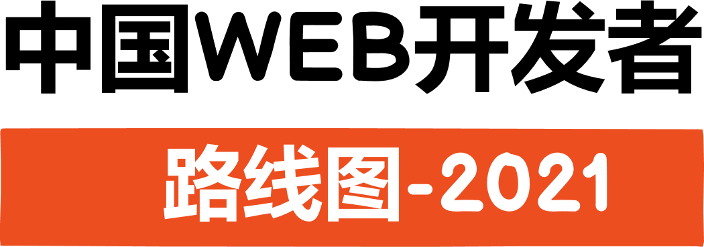
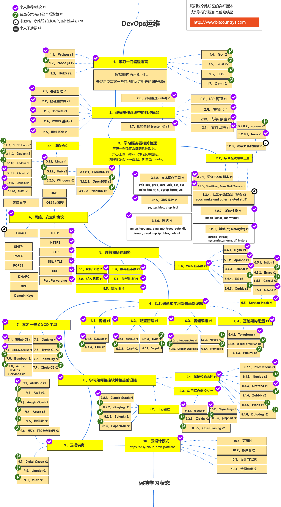

> 2021 年成为 web 开发人员路线图

<!--

-->

首先感谢<a href="https://github.com/kamranahmedse">kamranahmedse</a>制作的英文版思维导图，由于中国大陆开发环境和国外不大一样，所以制作一份中国版 web 开发者路线图。
下面是他在 youtube（网络问题自行解决） 制作的介绍视频，这些视频展示了您可以采用的路径以及要成为前端，后端或开发者所要采用的技术。

---

		特别声明：
		 
		
		 
		<b>我们现在有一个YouTube频道，</b>
		 
		我计划在其中介绍路线图，并在其中放置更多内容订阅频道。 <a href="https://www.youtube.com/channel/UCA0H2KIWgWTwpTFjSxp0now?sub_confirmation=1">你可以订阅这个频道</a>。

---

<h3 align="center"><strong>这些路线图的目的</strong></h3>

> 这些路线图的目的是让您对全景有一个了解，并在您对接下来要学习的内容感到困惑时为您提供指导，而不是鼓励您选择时髦的东西。您应该对为什么一种工具比其他工具更适合某些情况有一些了解，并且要记住，时髦的技术永远都不意味着最适合用来工作。

<h3 align="center"><strong>初学者忠告</strong></h3>

> 这些路线图列出了所有可学路径。不要感到不知所措，如果您只是入门，就不需要一开始就学习所有内容。我们正在开发初学者版本，完成后将在 2021 年<a href="http://www.bitcountrys.com">尽快发布</a>。

---

如果您认为这些问题可以通过任何方式加以改进，请提出建议。

## 介绍

## 前端路线图

## 后端路线图

## DevOps 运维路线图

## 🚦 结语

如果您认为任何路线图可以改进，请随时在问题中讨论。另外，我也将继续改进，因此希望你 star 本源码库或收藏<a href="http://www.bitcountrys.com">bitcountrys.com</a>网站地址。

## 🙌 贡献方式

> 看看 [贡献文档](./CONTRIBUTING.md) ，了解如何更新路线图。

- 开 pull request 申请修改
- 在 issues 发布你的想法
- 传播这个 github 库和 bitcountrys.com 域名
- <a target="_blank"
  						href="http://mail.qq.com/cgi-bin/qm_share?t=qm_mailme&email=j_3m__zg_uH7-fb8z_ng9_Lu5uOh7ODi"
  						style="text-decoration:none;" rel="nofollow">发邮件联系我</a>

## 版权

看下这个版权说明（沿用源库协议） [license file](./LICENSE)
